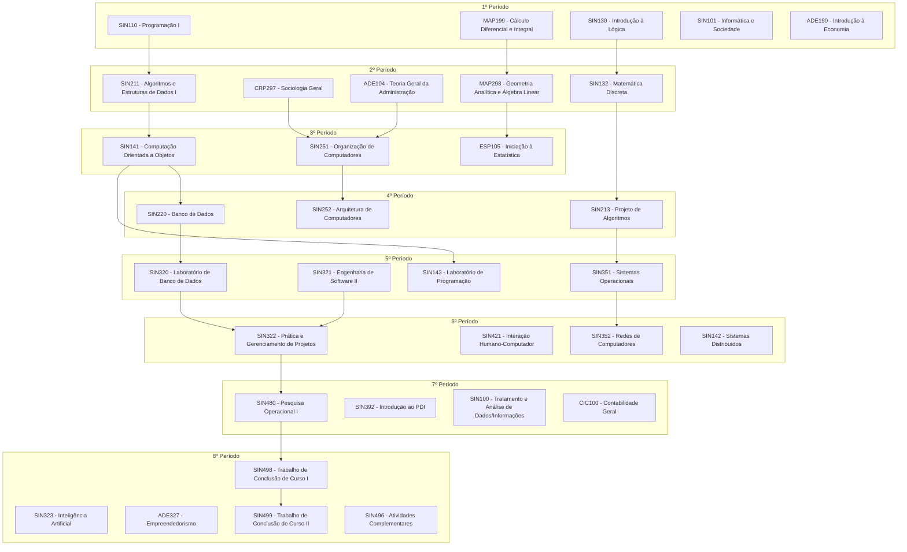

# Sistemas de Informação | UFV - CRP

[](https://github.com/CA-SI/Sistemas-de-Informacao_UFV-CRP)
[](https://github.com/CA-SI/Sistemas-de-Informacao_UFV-CRP/stargazers)
[](https://github.com/CA-SI/Sistemas-de-Informacao_UFV-CRP/network)
[](https://github.com/CA-SI/Sistemas-de-Informacao_UFV-CRP)
[](https://discord.gg/aR6cGkG)

## Sobre o Projeto

Este é o repositório público do curso de **Sistemas de Informação** da **Universidade Federal de Viçosa - Campus Rio Paranaíba (UFV-CRP)**.

### O que você encontrará aqui:

- Material suplementar para disciplinas do curso
- Links para blogs, revistas científicas e papers
- Vídeos educacionais e tutoriais
- Recursos compartilhados pela comunidade acadêmica
- Organização completa da grade curricular do curso

A colaboração é fundamental para o crescimento deste repositório. Siga as diretrizes, contribua com seu conhecimento e ajude a comunidade acadêmica!

## Como Usar

Você pode consultar o material disponível através do site: https://ca-si.github.io/SI-Repo/

## Estrutura do Repositório

O repositório está organizado por disciplinas, seguindo a estrutura da grade curricular:

### Disciplinas Obrigatórias

#### Núcleo de Sistemas de Informação (SIN)
- Fundamentos, Engenharia de Software, Banco de Dados
- Programação, Algoritmos e Estruturas de Dados
- Redes, Sistemas Operacionais e Arquitetura
- Inteligência Artificial e Projetos
- Trabalho de Conclusão de Curso (TCC I e II)

#### Formação em Gestão (ADE)
- Administração, Economia e Empreendedorismo

#### Formação Básica (CRP/MAP/ESP)
- Matemática, Estatística e disciplinas complementares

#### Outras Áreas (CIC)
- Contabilidade Geral

### Disciplinas Optativas
Diversas optativas disponíveis nas áreas de:
- Desenvolvimento de Software
- Dados e Inteligência Artificial
- Infraestrutura e Redes
- Jogos e Computação Gráfica

## Fluxograma do Curso

O diagrama abaixo mostra a organização das disciplinas obrigatórias por período e suas relações de pré-requisito:



## Índice Completo de Disciplinas

### ADE - Administração
- **[ADE101](ADE101-Fundamentos%20de%20Administração)** - Fundamentos de Administração
- **[ADE104](ADE104-Teoria%20Geral%20da%20Administração%201)** - Teoria Geral da Administração 1
- **[ADE190](ADE190-Introdução%20à%20Economia)** - Introdução à Economia
- **[ADE192](ADE192-Teoria%20Política)** - Teoria Política
- **[ADE302](ADE302-Organização,%20Sistemas%20e%20Métodos)** - Organização, Sistemas e Métodos
- **[ADE327](ADE327-Empreendedorismo)** - Empreendedorismo

### CIC - Ciências Contábeis
- **[CIC100](CIC100-Contabilidade%20Geral)** - Contabilidade Geral

### CRP - Campus Rio Paranaíba (Formação Básica)
- **[CRP192](CRP192-Iniciação%20à%20Estatística)** - Iniciação à Estatística
- **[CRP199](CRP199-Cálculo%20Diferencial%20e%20Integral)** - Cálculo Diferencial e Integral
- **[CRP280](CRP280-LIBRAS%20Língua%20Brasileira%20de%20Sinais)** - LIBRAS - Língua Brasileira de Sinais
- **[CRP290](CRP290-Português%20Instrumental%201)** - Português Instrumental 1
- **[CRP291](CRP291-Inglês%201)** - Inglês 1
- **[CRP297](CRP297-Sociologia%20Geral)** - Sociologia Geral
- **[CRP298](CRP298-Geometria%20Analítica%20e%20Álgebra%20Linear)** - Geometria Analítica e Álgebra Linear

### ESP - Estatística
- **[ESP105](ESP105-Iniciação%20à%20Estatística)** - Iniciação à Estatística

### MAP - Matemática Aplicada
- **[MAP199](MAP199-Cálculo%20Diferencial%20e%20Integral)** - Cálculo Diferencial e Integral
- **[MAP298](MAP298-Geometria%20Analítica%20e%20Álgebra%20Linear)** - Geometria Analítica e Álgebra Linear

### NUR - Outras Áreas
- **[NUR493](NUR493-Tópicos%20Especiais%20em%20Políticas%20de%20Saúde%20e%20Cidadania)** - Tópicos Especiais em Políticas de Saúde e Cidadania

### SIN - Sistemas de Informação

#### SIN 100-199 - Fundamentos e Programação Básica
- **[SIN100](SIN100-Tratamento%20e%20Análise%20de%20Dados%20Informações)** - Tratamento e Análise de Dados/Informações
- **[SIN101](SIN101-Informática%20e%20Sociedade)** - Informática e Sociedade
- **[SIN110](SIN110-Programação)** - Programação I
- **[SIN130](SIN130-Introdução%20a%20Lógica)** - Introdução à Lógica
- **[SIN131](SIN131-Introdução%20à%20Teoria%20da%20Computação)** - Introdução à Teoria da Computação
- **[SIN132](SIN132-Matemática%20Discreta)** - Matemática Discreta
- **[SIN141](SIN141-Computação%20Orientada%20a%20Objetos)** - Computação Orientada a Objetos
- **[SIN142](SIN142-Sistemas%20Distribuídos)** - Sistemas Distribuídos
- **[SIN143](SIN143-Laboratório%20de%20Programação)** - Laboratório de Programação

#### SIN 200-299 - Algoritmos, Engenharia e Arquitetura
- **[SIN211](SIN211-Algoritmos%20e%20Estruturas%20de%20Dados)** - Algoritmos e Estruturas de Dados I
- **[SIN213](SIN213-Projeto%20de%20Algoritmos)** - Projeto de Algoritmos
- **[SIN214](SIN214-Administração%20a%20Gerenciamento%20de%20Redes)** - Administração e Gerenciamento de Redes
- **[SIN220](SIN220-Banco%20de%20Dados)** - Banco de Dados
- **[SIN221](SIN221-Engenharia%20de%20Software%201)** - Engenharia de Software I
- **[SIN222](SIN222-Fundamentos%20de%20Sistemas%20de%20Informação)** - Fundamentos de Sistemas de Informação
- **[SIN223](SIN223-Análise%20e%20Projeto%20Orientados%20a%20Objetos)** - Análise e Projeto Orientados a Objetos
- **[SIN251](SIN251-Organização%20de%20Computadores)** - Organização de Computadores
- **[SIN252](SIN252-Arquitetura%20de%20Computadores)** - Arquitetura de Computadores

#### SIN 300-399 - Áreas Avançadas e Especializadas
- **[SIN320](SIN320-Laboratório%20de%20Banco%20de%20Dados)** - Laboratório de Banco de Dados
- **[SIN321](SIN321-Engenharia%20de%20Software%20II)** - Engenharia de Software II
- **[SIN322](SIN322-Prática%20de%20Gerenciamento%20de%20Projetos)** - Prática e Gerenciamento de Projetos
- **[SIN323](SIN323-Inteligência%20Artificial)** - Inteligência Artificial
- **[SIN341](SIN341-Soluções%20de%20TI%20Baseadas%20em%20Software%20Livre)** - Soluções de TI Baseadas em Software Livre
- **[SIN342](SIN342-Soluções%20Web%20Baseadas%20em%20Software%20Livre)** - Soluções Web Baseadas em Software Livre
- **[SIN343](SIN343-Desafios%20de%20Programação)** - Desafios de Programação
- **[SIN351](SIN351-Sistemas%20Operacionais)** - Sistemas Operacionais
- **[SIN352](SIN352-Redes%20de%20Computadores)** - Redes de Computadores
- **[SIN390](SIN390-Computação%20Gráfica)** - Computação Gráfica
- **[SIN390](SIN390-Introdução%20à%20Visão%20Computacional)** - Introdução à Visão Computacional
- **[SIN391](SIN391-Hipermídia)** - Hipermídia
- **[SIN392](SIN392-Introdução%20ao%20Processamento%20Digital%20de%20Imagens)** - Introdução ao Processamento Digital de Imagens
- **[SIN393](SIN393-Introdução%20ao%20Processamento%20Digital%20de%20Imagens)** - Introdução ao Processamento Digital de Imagens
- **[SIN394](SIN394-Introdução%20aos%20Jogos%20Digitais)** - Introdução aos Jogos Digitais
- **[SIN395](SIN395-Realidade%20Virtual)** - Realidade Virtual

#### SIN 400-499 - Tópicos Avançados e Especializações
- **[SIN420](SIN420-Banco%20de%20Dados%20Geográficos)** - Banco de Dados Geográficos
- **[SIN421](SIN421-Interação%20Humano-Computador)** - Interação Humano-Computador
- **[SIN422](SIN422-Qualidade%20de%20Software)** - Qualidade de Software
- **[SIN423](SIN423-Verificação,%20Validação%20e%20Teste%20de%20Software)** - Verificação, Validação e Teste de Software
- **[SIN430](SIN430-Teoria%20dos%20Grafos)** - Teoria dos Grafos
- **[SIN440](SIN440-Avaliação%20de%20Desempenho%20de%20Sistemas%20Computacionais)** - Avaliação de Desempenho de Sistemas Computacionais
- **[SIN441](SIN441-Tópicos%20em%20Sistemas%20Distribuídos)** - Tópicos em Sistemas Distribuídos
- **[SIN451](SIN451-Segurança%20da%20Informação)** - Segurança da Informação
- **[SIN452](SIN452-Redes%20de%20Alto%20Desempenho)** - Redes de Alto Desempenho
- **[SIN460](SIN460-Mineração%20de%20Dados)** - Mineração de Dados
- **[SIN480](SIN480-Pesquisa%20Operacional%201)** - Pesquisa Operacional I
- **[SIN481](SIN481-Pesquisa%20Operacional%202)** - Pesquisa Operacional II
- **[SIN492](SIN492-Tópicos%20Especiais)** - Tópicos Especiais II
- **[SIN493](SIN493-Tópicos%20Especiais%20III)** - Tópicos Especiais III
- **[SIN496](SIN496-Atividades%20Complementares)** - Atividades Complementares
- **[SIN498](SIN498-Trabalho%20de%20Conclusão%20de%20Curso%20I)** - Trabalho de Conclusão de Curso I
- **[SIN499](SIN499-Trabalho%20de%20Conclusão%20de%20Curso%20II)** - Trabalho de Conclusão de Curso II

## Diretrizes de Contribuição

### Regras Gerais
- Conteúdo de **Licença Pública ou Livre** pode ser enviado, desde que relevante e categorizado devidamente
- Você deve ter **todas as licenças e direitos** sobre o conteúdo que está enviando
- **Pesquise antes**: não é admitido conteúdo duplicado
- **Categorize devidamente** o envio. Em caso de dúvida, abra uma [issue](https://github.com/CA-SI/Sistemas-de-Informacao_UFV-CRP/issues)
- Participe das discussões sobre [novas diretrizes](https://github.com/CA-SI/Sistemas-de-Informacao_UFV-CRP/issues/1)

## Como Contribuir

### Requisitos
- Git
- Node.js (NPM ou Yarn)

### Passo a Passo

1. **Fork o projeto**
   - Clique no botão de fork ou use: [](https://github.com/CA-SI/Sistemas-de-Informacao_UFV-CRP/fork)

2. **Clone seu fork**
   ```bash
   git clone https://github.com/<seu-usuario>/Sistemas-de-Informacao_UFV-CRP/
   cd Sistemas-de-Informacao_UFV-CRP
   ```

3. **Crie uma branch para suas alterações**
   ```bash
   git checkout -b minha-contribuicao
   ```

4. **Adicione seu material**
   - Coloque os arquivos nas pastas correspondentes às disciplinas
   - Mantenha a organização existente

5. **Commit suas alterações**
   ```bash
   git add .
   git commit -m "Adiciona material sobre [assunto] em [disciplina]"
   ```

6. **Envie para seu fork**
   ```bash
   git push origin minha-contribuicao
   ```

7. **Abra um Pull Request**
   - Acesse seu fork no GitHub
   - Clique em "Compare & pull request"
   - Descreva suas alterações e envie

## Tecnologias Utilizadas

Este projeto utiliza:
- **Yarn** (v4.11.0+) - Gerenciador de pacotes
- **all-contributors-cli** - Gerenciamento de colaboradores
- **Git** - Controle de versão

## Moderadores

Para adicionar um colaborador ao aceitar um Pull Request ou em uma Issue, comente:

```
@all-contributors please add @username for infrastructure, tests and code
```

Consulte a [tabela All Contributors](https://allcontributors.org/docs/pt-br/emoji-key) para ver todos os tipos de contribuição disponíveis.

## Colaboradores

Agradecemos a todas as pessoas que contribuíram para este projeto!

<!-- ALL-CONTRIBUTORS-LIST:START - Do not remove or modify this section -->
<!-- prettier-ignore -->
| [<br /><sub><b>Matheus Rocha Vieira</b></sub>](http://matheu.srv.br)<br />[💻](https://github.com/MatheusRV/sistemas-de-informacao_ufv-crp/commits?author=MatheusRV "Code") [🎨](#design-MatheusRV "Design") [📖](https://github.com/MatheusRV/sistemas-de-informacao_ufv-crp/commits?author=MatheusRV "Documentation") | [<br /><sub><b>Igor Alves</b></sub>](http://linkedin.com/in/igor-lucio-alves/)<br />[📖](https://github.com/MatheusRV/sistemas-de-informacao_ufv-crp/commits?author=iguit0 "Documentation") | [<br /><sub><b>Walter</b></sub>](https://sphinxs.github.io)<br />[📖](https://github.com/MatheusRV/sistemas-de-informacao_ufv-crp/commits?author=Sphinxs "Documentation") |
| :---: | :---: | :---: |
<!-- ALL-CONTRIBUTORS-LIST:END -->

Este projeto segue a especificação [all-contributors](https://github.com/kentcdodds/all-contributors). Contribuições de qualquer tipo são bem-vindas!

## Licença

Este projeto está licenciado sob a Licença MIT - veja o arquivo [LICENSE](LICENSE) para mais detalhes.

---

**Desenvolvido com dedicação pela comunidade acadêmica de Sistemas de Informação da UFV-CRP**
